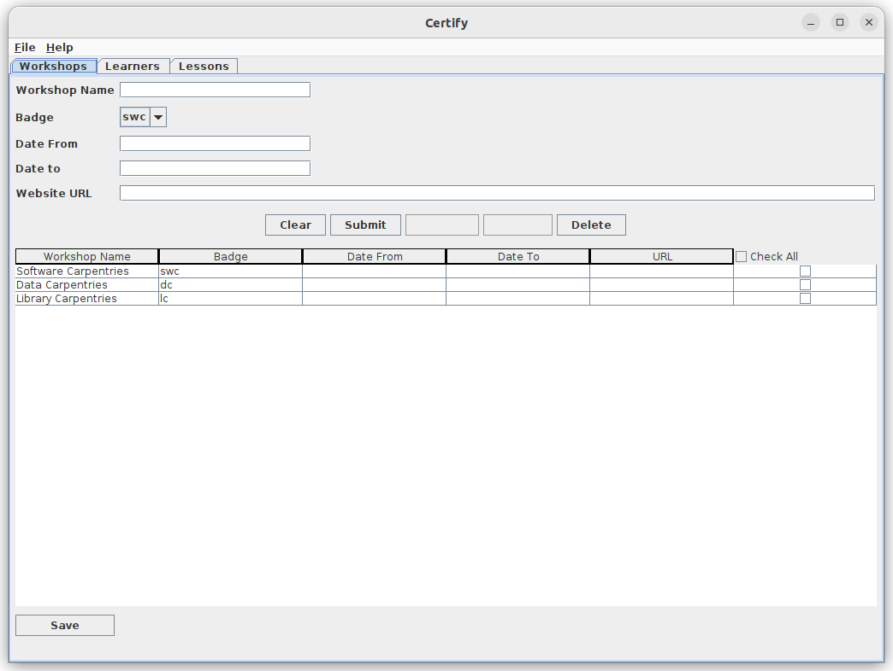

# Certify

Every once in a blue moon, a student requests a certificate of attendance for
a Software, Data or Library Carpentries Workshop.

This little program is for generating such certicates. There is a repository
in [The Carpentries GitHub account](https://github.com/carpentries/learner-certificates) 
for generating certificates but because
I find getting Python scripts to run such a faff that I decided to write this
program, which also incorporates a few features that I require due to the way 
we run workshops at my institution. 
 
The program works by allowing the user to capture workshops, lessons and learners. 
For its very basic use you only need one workshop added and the learners. I 
have pre-populated the program with three workshops, `Data Carpentries`, 
`Library Carpentries` and `Software Carpentries`. I also added the core lessons 
from the library and software Carpentries workshop.  I haven't added the Data
Carpentries lesson because 1) I have not had to use them and 2) I'll have to 
add scroll bars to that part of the window because the list of lessons will 
become too long - but I'll do this if other want to use the program in this 
way.

For the moment I store data in three 
`JSON` files, `Learners.json`, `Workshops.json` and `Lessons.json`. 
If there is a need for the use of a database, I can add it in time.
If you don't want these pre-populated data files, you can just delete them. The
program will create empty files on startup if they don't exist.

When you start the program it will display the `Workshop Panel`:

